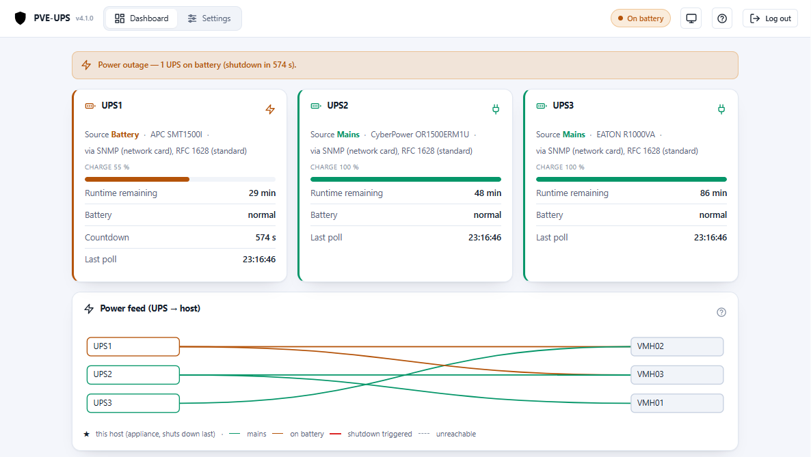
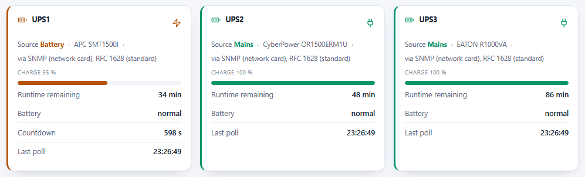
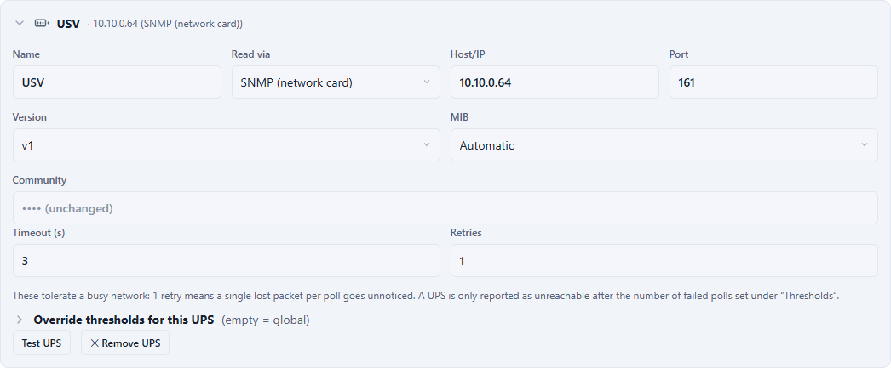
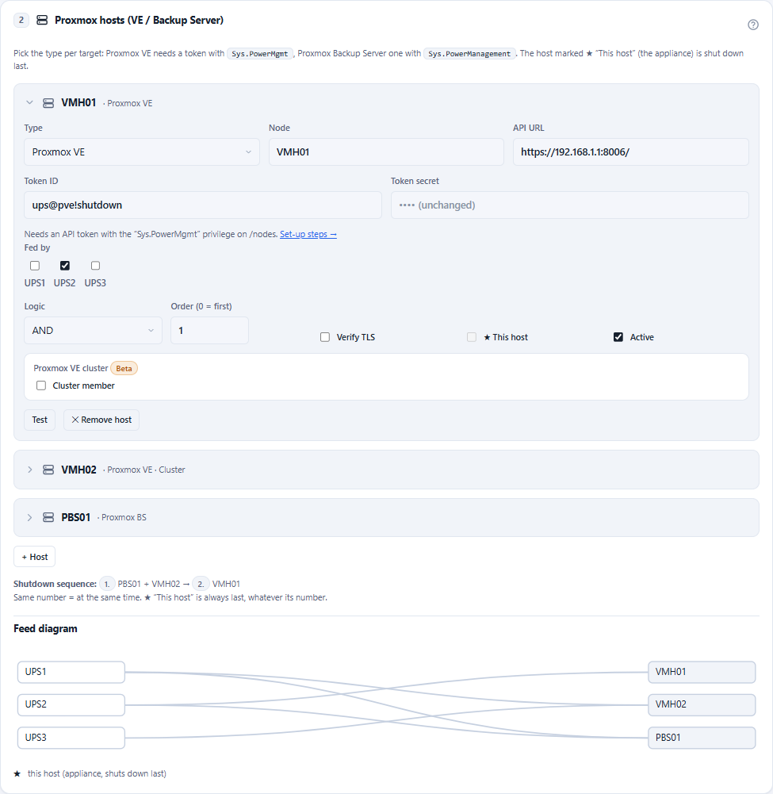

# PVE-UPS

**GUI-basierte USV-Shutdown-Appliance für Proxmox VE — mit Web-Wizard und ohne
Konfigurationsdateien.**

*English version: [README.md](README.md)*

PVE-UPS überwacht eine oder mehrere USVs — **mit SNMP-Netzwerkkarte (Standard RFC 1628
oder Hersteller-MIB wie APC PowerNet)** oder **über einen NUT-Server**, worüber USB- und
seriell angeschlossene USVs gelesen werden — und fährt bei Stromausfall einen oder mehrere
**Proxmox-VE-Hosts** geordnet herunter. Der moderne Ersatz für herstellergebundene Appliances wie APC
PowerChute Network Shutdown. Die komplette Einrichtung läuft über einen **Web-Wizard**;
Monitoring gibt es als **REST/JSON**.

## Warum nicht NUT?

[NUT](https://networkupstools.org/) hat hervorragende Hardware-Unterstützung, bedeutet für
den üblichen Fall „fahre meine Proxmox-Hosts herunter, wenn die USV zur Neige geht" aber
`upsd`-/`upsmon`-Konfigdateien und eigene Shutdown-Skripte auf jedem Host. PVE-UPS geht
stattdessen den Appliance-Weg — und wo man NUTs Hardware-Unterstützung braucht, nutzt es
NUT als *Treiber*, statt es zu ersetzen:

- **Ein LXC, ein Installer** — ein unprivilegierter Debian-Container (~256 MB RAM),
  angelegt mit einem einzigen Befehl auf dem PVE-Host.
- **Keine Konfigdateien** — ein Web-Wizard mit Test-Buttons für jeden Schritt;
  Einstellungen greifen sofort.
- **Keine Agenten auf den Hosts** — der Shutdown läuft über die Proxmox-API mit einem
  dedizierten, widerrufbaren **API-Token**, das nur das Recht `Sys.PowerMgmt` besitzt.
  Nirgendwo Root-SSH.
- **Herstellerneutral, aber nicht blauäugig** — die Standard-RFC-1628-UPS-MIB per
  SNMP v1/v2c/v3 (reine Python-Implementierung, kein net-snmp), mit automatischem Wechsel
  auf eine Hersteller-MIB, wo der Standard nicht reicht (APC PowerNet) — oder jeder
  vorhandene NUT-Server als nur-lesender Client.
- **NUT bleibt Treiber, nie das Gehirn** — PVE-UPS liest von `upsd` ausschließlich
  Variablen. Kein `upsmon`, kein `upssched`, keine Shutdown-Skripte: Schwellen,
  Host-Logik und Entscheidung bleiben in der Appliance, wo man sie sieht.

## Screenshots

*Dashboard während eines Stromausfalls — eine USV im Akkubetrieb, Shutdown-Countdown läuft:*



<details>
<summary>Weitere Screenshots (USV-Status, Schaubild, USV- &amp; Host-Einstellungen)</summary>

*USV-Statuskarten:*



*Live-Schaubild der Versorgung (USV → Host):*


*USV-Einstellungen mit Schwellen-Overrides je USV:*



*Host-Einstellungen (API-Token, Versorgung, UND/ODER-Logik):*



</details>

## Installation

In der **Proxmox-Node-Shell** ausführen (Webinterface → Node → `>_ Shell`, als root).
Das Skript lädt das aktuelle Release nach, entpackt es und legt den LXC an:

```bash
bash -c "$(curl -fsSL https://github.com/ffind-dev/pve-ups/releases/latest/download/install.sh)"
# mit Optionen, z.B. fester IP:
curl -fsSL https://github.com/ffind-dev/pve-ups/releases/latest/download/install.sh | bash -s -- \
  --ctid 950 --ip 10.0.0.50/24 --gateway 10.0.0.1 --hostname pve-usv
```

PVE-UPS ist außerdem auf [community-scripts.org](https://community-scripts.org/) gelistet
(dort nach „PVE-UPS" suchen) — einer community-gepflegten Sammlung von
Proxmox-Helper-Skripten. Der Einzeiler oben bleibt der Referenzweg.

Danach das Webinterface auf **`http://<container-ip>:8080`** öffnen:
1. UI-Passwort setzen.
2. Wizard durchlaufen (USVs → Hosts → Schwellwerte → optional Webhook).
3. Solange **Dry-Run** aktiv ist, wird nichts heruntergefahren — ideal zum Testen.
4. Wenn alles passt: **Dry-Run deaktivieren** (Modus „SCHARF").

> Der LXC läuft typischerweise auf einem der zu schützenden Hosts. Diesen in der
> Host-Liste als **„Dieser Host"** markieren — er wird dann garantiert zuletzt
> heruntergefahren.

## Docker (alternative Bereitstellung)

Kein LXC gewünscht? Bei jedem Release wird zusätzlich ein fertiges Image nach
[`ghcr.io/ffind-dev/pve-ups`](https://github.com/ffind-dev/pve-ups/pkgs/container/pve-ups)
veröffentlicht:

```bash
curl -fsSLO https://raw.githubusercontent.com/ffind-dev/pve-ups/main/docker-compose.example.yml
mv docker-compose.example.yml docker-compose.yml
docker compose up -d
```

Das bindet zwei benannte Volumes ein (`/etc/pve-usv` für die Konfiguration,
`/var/lib/pve-usv` für Eventlog/Zustand), damit die Daten eine Neuerstellung des
Containers überstehen. Danach `http://<container-host>:8080` öffnen und wie gewohnt
den Wizard durchlaufen.

**Der Docker-Modus unterscheidet sich in zwei Punkten vom LXC**, weil es dort keinen
privilegierten Begleitprozess (kein systemd) im Image gibt:
- **Keine In-App-Updates.** Der Button „Update-Paket hochladen" ist ausgeblendet;
  Updates erfolgen durch ein neues Image-Tag
  (`docker compose pull && docker compose up -d`). Konfiguration und Eventlog bleiben
  in den Volumes erhalten.
- **Keine NTP-/Zeitzonen-Verwaltung über den Wizard.** Zeit und Zeitzone liegen in der
  Verantwortung des Docker-Hosts/Orchestrators — **`TZ` am Container setzen** (die
  Beispiel-Compose-Datei tut das). Der Selbsttest-Zeitplan gilt in der lokalen Zeit des
  Containers; ohne `TZ` läuft der Container in UTC.

> **Liegt das eigene Netz innerhalb von `172.17.0.0/16` – `172.31.0.0/16`**, den
> Standard-Adresspool von Docker *vor* dem Start des Containers verschieben — Docker
> beansprucht diesen Bereich für seine Bridges, und der Container würde eine USV oder
> einen Proxmox-Host darin nicht mehr erreichen. In `/etc/docker/daemon.json`:
> `{"bip":"10.210.0.1/24","default-address-pools":[{"base":"10.211.0.0/16","size":24}]}`,
> danach `systemctl restart docker`.

Alles Weitere (SNMP-Polling, Proxmox-Shutdown, Schwellwerte, Webhook, Selbsttest)
funktioniert identisch zur LXC-Bereitstellung. Die LXC-Installation (oben) bleibt der
primäre, vollständig selbst-aktualisierende Weg.

## Proxmox-Hosts anbinden (API-Token)

Die Appliance fährt Hosts über die Proxmox-API herunter — kein Root-SSH, kein Agent auf
dem Host. Sie braucht einen dedizierten Benutzer mit **einem einzigen Recht**
(`Sys.PowerMgmt`) und einen API-Token. **Einmalig** in einer Node-Shell (als root):

```bash
# 1) Dedizierten Benutzer anlegen (PVE-Realm)
pveum user add ups@pve

# 2) Rolle mit nur dem Power-Management-Recht
pveum role add UpsShutdown -privs "Sys.PowerMgmt"

# 3) Rolle auf /nodes vergeben (oder enger: /nodes/<name>)
pveum acl modify /nodes -user ups@pve -role UpsShutdown

# 4) API-Token erzeugen — Privilege Separation AUS, damit der Token das Recht erbt
pveum user token add ups@pve shutdown --privsep 0
```

Der letzte Befehl gibt die **Token-ID** (`ups@pve!shutdown`) und das **Secret** aus (eine
UUID, wird nur dieses eine Mal angezeigt — jetzt kopieren). Beides im Wizard unter
**Proxmox-Hosts** eintragen (API-URL ist `https://<host-ip>:8006`) und die Verbindung mit
**Test** prüfen.

- **Im Cluster die Befehle nur einmal ausführen, auf einem beliebigen Knoten.** Benutzer,
  API-Token und ACLs liegen auf Datacenter-Ebene (`/etc/pve`) und gelten damit auf jedem
  Knoten — bei jedem Host-Eintrag *dieselbe* Token-ID und dasselbe Secret eintragen. Bei
  Standalone-Hosts ohne gemeinsamen Cluster die Befehle je Host wiederholen.
- Jedem Host-Eintrag **seine eigene API-URL** geben (`https://<ip-dieses-knotens>:8006`).
  Die API würde eine Anfrage zwar an einen anderen Knoten weiterreichen, aber ein bereits
  heruntergefahrener Knoten kann das für die nachfolgenden nicht mehr tun.
- **TLS prüfen** aus lassen, solange der Host das selbstsignierte Proxmox-Zertifikat nutzt.
- Der Token ist jederzeit widerrufbar: `pveum user token remove ups@pve shutdown`.

## Funktionen

- **Mehrere USVs** pro Instanz mit Host↔USV-Zuordnung und Logik pro Host
  (**UND** = redundante Netzteile, **ODER** = aufgeteilte Last), inkl. Live-Schaubild.
- **Zwei USV-Quellen**, in einer Instanz frei mischbar:
  - **SNMP v1/v2c und v3** (authPriv), nur lesend. Liest die Standard-RFC-1628-UPS-MIB
    oder eine **Hersteller-MIB** — derzeit **APC PowerNet**, womit APC-Karten
    funktionieren, die RFC 1628 nur teilweise (NMC2 unter Firmware sumx/sy v5.1.7) oder gar
    nicht (NMC1: AP9617/AP9618/AP9619) implementieren. Wird je USV automatisch erkannt und
    lässt sich von Hand festlegen.
  - **NUT-Server** (TCP 3493) als nur-lesender Client — für USVs ohne Netzwerkkarte.
    Funktioniert mit dem eingebauten USV-Server einer Synology/QNAP/TrueNAS, einem
    Raspberry Pi, OPNsense oder einem NUT auf einem Proxmox-Host. QNAP und Synology geben
    ihre Werte fest vor (QNAP: USV-Name `qnapups`, Benutzer `admin`, Kennwort `123456`;
    Synology: USV-Name und Benutzer `ups`, kein Kennwort) und antworten nur Hosts, die in
    ihrer Freigabeliste stehen — siehe Handbuch, Abschnitt 5.
- **Web-Wizard** für USVs, Hosts, Schwellwerte und Benachrichtigungen — mit Test-Buttons;
  der USV-Test schlüsselt sein Ergebnis je Objekt auf, sodass fehlende OID bzw.
  NUT-Variable, falsche Zugangsdaten und blockierter Port auf einen Blick unterscheidbar
  sind. Er benennt außerdem die Auslöser, die das Gerät gar nicht bedienen kann — so
  bleibt keine Schwelle stillschweigend wirkungslos.
- **Zweisprachige Oberfläche**: Englisch (Standard) und Deutsch, automatisch passend
  zur Browsersprache; eingebautes Benutzerhandbuch (beide Sprachen).
- **Schwellen-Overrides je USV** zusätzlich zu den globalen Standardwerten.
- **Webhook-Benachrichtigungen** bei wichtigen Ereignissen — als vollständiges Status-JSON,
  als **Microsoft-Teams**-Karte oder als Klartext, mit Stufenfilter und Testversand.
- **REST-Status** (`/api/status`, `/api/health`) — lesend, ohne Auth, ohne Secrets;
  Ereignisprotokoll der letzten 48 h inklusive. Ereignis-/Webhook-Texte sind einheitlich
  englisch.
- **Konfigurations-Export/-Import**, NTP/Zeitzone, regelmäßiger Proxmox-Selbsttest
  (Startzeit plus Intervall von 15 min bis 24 h), In-Place-**Updates per Paket-Upload**
  im Webinterface.

## Sicherheitsmodell

- **Fail-safe als Standard:** ein Kontaktverlust zur USV ist *kein* bestätigter
  Stromausfall — er löst Alarm aus und fährt nie etwas herunter. Das gilt genauso für
  einen NUT-Server, der wegen eines abgestürzten Treibers veraltete Daten liefert: das
  zählt als nicht erreichbar, nie als „Netzbetrieb". Zwei explizite Opt-ins
  verfeinern das: einen bestätigten Akkubetrieb-Countdown über den Verbindungsverlust
  hinweg fortsetzen (Standard an) und einen anhaltenden reinen Kommunikationsverlust doch
  als Ausfall behandeln (Standard aus).
- **Dry-Run als Standard:** nach der Installation protokolliert die Engine nur, was sie
  tun würde. Ein **Test-Shutdown** simuliert die Abschaltreihenfolge ohne Wirkung.
- Ein ausgelöster Trigger und der Akkubetrieb-Countdown werden **auf Platte persistiert**
  und überstehen einen Dienst-Neustart.
- **„Eigener Host zuletzt":** der Host, der die Appliance trägt, fährt immer zuletzt
  herunter.
- Die App läuft **unprivilegiert**; ein schmaler privilegierter Begleiter wendet Updates
  und NTP-/Zeitzonen-Änderungen an. Secrets verlassen die Appliance nie über die API.

## Standard-Auslöser

Es genügt **eine** zutreffende Bedingung (im Wizard änderbar; Feld leeren = aus):

| Bedingung | Standard |
|---|---|
| Akkubetrieb länger als | 600 s |
| Restlaufzeit unter | 10 min |
| Ladestand unter | 30 % |
| USV meldet `battery low/depleted` | an |

Poll-Intervall: 30 s im Netzbetrieb, 8 s im Akkubetrieb.

## Updates

Das Release-Paket (`pve-usv-<version>.tar.gz`) von der
[Release-Seite](https://github.com/ffind-dev/pve-ups/releases) herunterladen und im
Webinterface unter **Update** hochladen. Die Konfiguration bleibt erhalten; der Dienst
startet automatisch neu. Das Update von 2.x funktioniert genauso (die zwei
Verhaltensänderungen stehen im Handbuch).
Läuft die Appliance in Docker? Siehe [Docker](#docker-alternative-bereitstellung) oben —
dort erfolgen Updates über ein neues Image-Tag.

> **Hinweis:** Der Produktname ist PVE-UPS, technisch heißen Dienst und Pfade aber
> `pve-usv` (`systemctl status pve-usv`, `/etc/pve-usv/config.yaml`,
> `/var/lib/pve-usv/`). Das ist beabsichtigt und hält bestehende Installationen kompatibel.

## Entwickeln / testen ohne Hardware

```bash
python -m venv .venv && . .venv/bin/activate
pip install -e ".[dev]"
pytest                       # Unit-Tests, keine Hardware nötig

# SNMP-USV simulieren (separates Terminal); Snapshots unter ./snmpdata/:
snmpsim-command-responder --data-dir=./snmpdata --agent-udpv4-endpoint=127.0.0.1:1161

# ... oder einen NUT-Server simulieren:
python -m tests.nutsim --port 3493 --scenario battery   # mains | battery | low | sparse

PVE_USV_CONFIG=./dev-config.yaml PVE_USV_DB=./dev-events.db python -m app.main
# UI: http://127.0.0.1:8080
#   SNMP: Host 127.0.0.1, Port 1161, Community "public"  -> Netzbetrieb (100 %)
#                                    Community "battery" -> Stromausfall -> Auslöser greifen
#         Die APC-Snapshots enthalten nur PowerNet-OIDs, also eine Karte ohne RFC 1628:
#                                    Community "apc"         -> Netzbetrieb, MIB wird APC
#                                    Community "apc-battery" -> Stromausfall auf der APC-MIB
#   NUT:  Host 127.0.0.1, Port 3493, USV-Name "ups"
```

## Grenzen / Annahmen

- Hosts werden **einzeln** über ihre jeweils eigene API heruntergefahren. Knoten eines
  Clusters funktionieren als Ziel (ein datacenter-weites Token deckt alle ab), aber PVE-UPS
  fasst **HA-Manager und Quorum nicht an** und löst keine Abhängigkeiten zwischen Knoten
  auf — mögliche spätere Erweiterung.
- Liest die Standard-RFC-1628-UPS-MIB, die APC-PowerNet-MIB oder die Variablen eines
  NUT-Servers. Weitere Hersteller-MIBs sind noch nicht umgesetzt — ein Gerät außerhalb
  davon braucht entweder RFC 1628 oder einen NUT-Treiber. Die Appliance selbst spricht kein
  USB/seriell; eine lokal angeschlossene USV wird über einen NUT-Server erreicht.
- Das NUT-Protokoll ist unverschlüsselt. Es gehört in ein vertrauenswürdiges Netz — oder
  auf einen `upsd`, der nur auf dem Loopback-Interface derselben Maschine lauscht.
- In der optionalen Docker-Bereitstellung sind In-App-Updates und NTP-/Zeitzonen-Verwaltung
  nicht verfügbar (siehe [Docker](#docker-alternative-bereitstellung)) — alles Weitere ist
  identisch.

## Lizenz

MIT — Copyright © 2026 Florian Finder. Siehe [LICENSE](LICENSE).

<sub>Entwickelt mit KI-Unterstützung.</sub>
